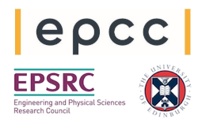

# Cirrus

Cirrus is a HPC and data science service hosted and run by
[EPCC](http://www.epcc.ed.ac.uk) at [The University of
Edinburgh](http://www.ed.ac.uk). It is one of the
[EPSRC](http://www.epsrc.ac.uk) Tier-2 National HPC Services.

Cirrus is available to industry and academic researchers. For
information on how to get access to the system please see the [Cirrus
website](http://www.cirrus.ac.uk).

The Cirrus facility is based around an SGI ICE XA system. There are 280
standard compute nodes and 38 GPU compute nodes. Each standard compute
node has 256 GiB of memory and contains two 2.1 GHz, 18-core Intel Xeon
(Broadwell) processors. Each GPU compute node has 384 GiB of memory,
contains two 2.4 GHz, 20-core Intel Xeon (Cascade Lake) processors and
four NVIDIA Tesla V100-SXM2-16GB (Volta) GPU accelerators connected to
the host processors and each other via PCIe. All nodes are connected
using a single Infiniband fabric. This documentation covers:

- Cirrus User Guide: general information on how to use Cirrus
- Software Applications: notes on using specific software applications
  on Cirrus
- Software Libraries: notes on compiling against specific libraries on
  Cirrus. Most libraries work *as expected* so no additional notes are
  required however a small number require specific documentation
- Software Tools: Information on using tools such as debuggers and
  profilers on Cirrus

Information on using the SAFE web interface for managing and reporting
on your usage on Cirrus can be found on the [Tier-2 SAFE
Documentation](http://tier2-safe.readthedocs.io/en/latest/)

This documentation draws on the
documentation for the [ARCHER2 National Supercomputing
Service](http://docs.archer2.ac.uk).

