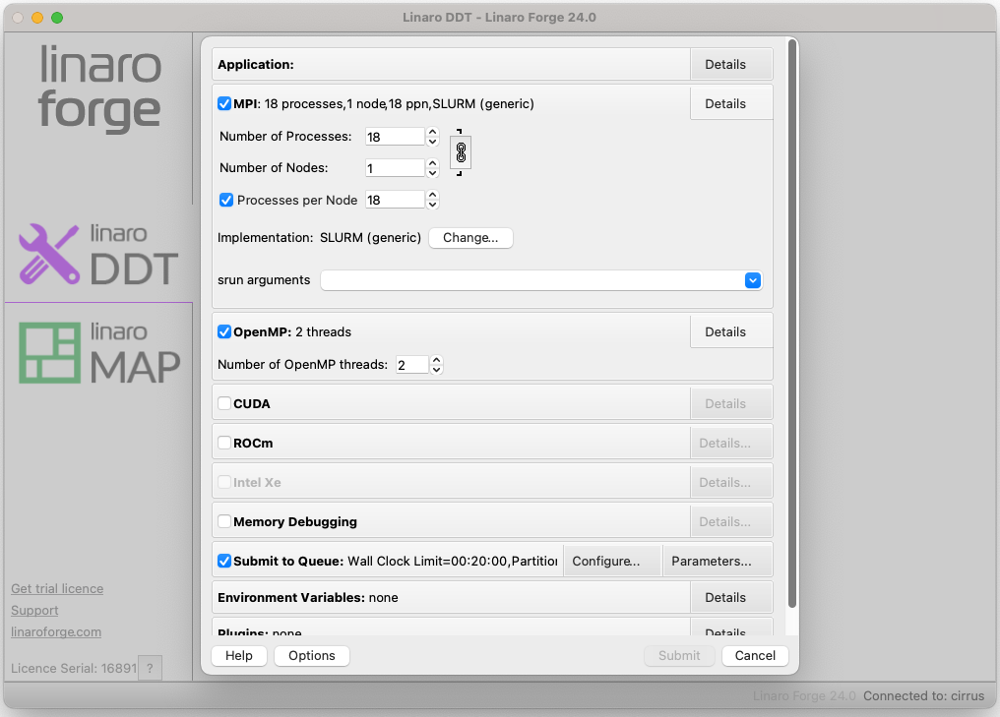
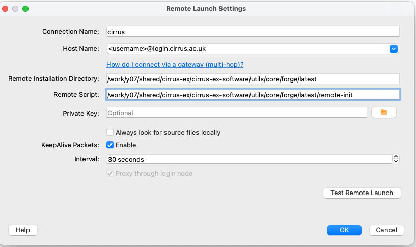

# Linaro Forge


[Linaro Forge](https://www.linaroforge.com/) provides debugging and profiling
tools for MPI parallel applications, and OpenMP or pthreads multi-threaded
applications (and also hydrid MPI/OpenMP). Forge DDT is the debugger and MAP
is the profiler.


## User interface

There are two ways of running the Forge user interface. If you have a good
internet connection to Cirrus, the GUI can be run on the front-end
(with an X-connection). Alternatively, one can download a copy of the Forge
remote client to your laptop or desktop, and run it locally. The remote
client is recommended.

To download the remote client, see the
[Forge download pages](https://www.linaroforge.com/downloadForge/).
You will need the latest version of the client to be consistent with
the version of Forge installed on Cirrus. The remote client
is discussed further in
[Connecting with the remote client](#connecting-with-the-remote-client).

## One time set-up for using Forge

A preliminary step is required to set up the necessary
Forge configuration files that allow DDT and MAP to initialise its
environment correctly so that it can, for example, interact with
the Slurm queue system. These steps should be performed in the `/work`
file system on Cirrus.

It is recommended that these commands are performed in the top-level work
file system directory for the user account, i.e., `${HOME/home/work}`.

```bash
module load forge
cd ${HOME/home/work}
source ${FORGE_ROOT}/config-init
```

Running the `source` command will create a directory `${HOME/home/work}/.forge` that contains the
following files.

```output
system.config  user.config
```

Within the `system.config` file you should find that `shared directory` is set to the equivalent of `${HOME/home/work/.forge}`.
That directory will also store other relevant files when Forge is run.

## Using DDT

DDT (**D**istributed **D**ebugging **T**ool) provides an easy-to-use graphical
interface for source-level debugging of compiled C/C++ or Fortran codes.
It can be used for non-interactive debugging, and there
is also some limited support for python debugging.

### Preparation

To prepare your program for debugging, compile and link in the normal way
but remember to include the `-g` compiler option to retain symbolic
information in the executable. For some programs, it may be necessary
to reduce the optimisation to `-O0` to obtain full and consistent
information. However, this in itself can change the behaviour of bugs,
so some experimentation may be necessary.

### Post-mortem, or offline, debugging

A non-interactive method of debugging is available which allows information
to be obtained on the state of the execution at the point of failure in a
batch job.

Such a job can be submitted to the batch system in the usual way. The
relevant command to start the executable is as follows.

```slurm
# ... Slurm batch commands as usual ...

module load forge

export OMP_NUM_THREADS=12
export OMP_PLACES=cores

ddt --verbose --offline --mpi=slurm --np 12 \
    --mem-debug=fast --check-bounds=before \
    ./my_executable
```

The parallel launch is delegated to `ddt` and the `--mpi=slurm` option
indicates to `ddt` that the relevant queue system is Slurm
(there is no explicit `srun`). It will also be
necessary to state explicitly to `ddt` the number of processes
required (here `--np 12`). For other options see, e.g., `ddt --help`.

Note that higher levels of memory debugging can result in extremely
slow execution. The example given above uses the default
`--mem-debug=fast` which should be a reasonable first choice.

Execution will produce a `.html` format report which can be used
to examine the state of execution at the point of failure.

### Memory debugging

If you are dynamically linking your code and debugging it on the login
node then this is fine (just ensure that the *Preload the memory
debugging library* option is ticked in the *Details* pane.) If you are
dynamically linking but intending to debug running on the compute nodes,
or statically linking then you need to include the compile option
`-Wl,--allow-multiple-definition` and explicitly link your executable
with Forge's memory debugging library. The exactly library to link
against depends on your code; `-ldmalloc` (for no threading with C),
`-ldmallocth` (for threading with C), `-ldmallocxx` (for no threading
with C++) or `-ldmallocthcxx` (for threading with C++). The library
locations are all set up when the `forge` module is loaded so these
libraries should be found without further arguments.


### Interactive debugging: using the client to submit a batch job

You can also start the client interactively (for details of remote launch, see [Connecting with the remote client](#connecting-with-the-remote-client)).
`
```bash
module load forge
ddt
```

This should start a window as shown below. Click on the ***DDT*** panel on
the left, and then on the ***Run and debug a program*** option. This
will bring up the ***Run*** dialogue as shown.

Note:

* One can start either DDT or MAP by clicking the appropriate panel on
the left-hand side;

* If the license has connected successfully, a serial number will be
shown in small text at the lower left (see image below). One can click
on the question
mark icon next to the license serial number to see current information
on the status of the license (number of processes available and so on).




In the ***Application*** sub panel of the ***Run*** dialog box, details of the
executable, command line arguments or data files, the working directory
and so on should be entered.

Click the ***MPI*** checkbox and specify the MPI implementation. This is done
by clicking the ***Details*** button and then the ***Change*** button.
Choose the ***SLURM (generic)*** implementation from the drop-down menu
and click ***OK***. You can then specify the required number of nodes/processes
and so on.

Click the ***OpenMP*** checkbox and select the relevant number of threads
(if there is no OpenMP in the application itself, select 1 thread).

Click the ***Submit to Queue*** checkbox and then the associated
***Configure*** button. A new set of options will appear such as
***Submission template file***, where you can enter
`${FORGE_ROOT}/templates/cirrus.qtf` and click ***OK***.
This template file provides many of the options required for a standard
batch job.
You will then need to click on the ***Queue Parameters*** button in the same
section and specify the relevant project budget, see the ***Account*** entry.

The default queue template file configuration uses a QoS which must
be entered in the Submit to Queue ***Parameters*** dialogue, and a
standard time limit of 20 minutes. An account code is also required.
The default template is a non-exclusive submission.

Alternatively, one can copy the `cirrus.qtf` template file
to a suitable location in your work file space and make the relevant changes.
For example, if the application does not use the default programming
eniovironment, or requires additional modules to be loaded, module
commands should be added in the new queue template file.
This new template file can then be specified in the dialog window.

There may be a short delay while the sbatch job starts. Debugging should
then proceed as described in the [Linaro Forge documentation](https://docs.linaroforge.com/24.0/html/forge/ddt/index.html).


## Using MAP

MAP can be used to generate a profile to investigate the performance of a
program. The profile is based on sampling, so should not incur a significant
overhead. The program can be compiled in the usual way.

### Generating a profile

Submit a batch job in the usual way, and include a command of the form:

```slurm
# ... Slurm batch commands as usual ...

module load forge

map -n <number of MPI processes> --mpiargs="<srun options>" --profile ./my_executable
```
The `-n` option sets the number of MPI processes, and the `--mpiargs` option
should include arguments which would usually be passed to `srun`. For
example, one might set
```
export OMP_NUM_THREADS=12
export OMP_PLACES=cores

map -n 24 --mpiargs="--cpus-per-task=${OMP_NUM_THREADS}" --profile ./my_executable
```
to run on 24 MPI processes each with 12 OpenMP threads.

Successful execution will generate a file with a `.map` extension.

This `.map` file may be viewed via the MAP GUI (e.g., using the remote
client) by selecting the load profile data option. The `.map` file should
be selected in the file dialogue.

Text and HTML summaries can also be generated from the `.map`
file via, e.g.,
```
module load forge
perf-report my-application.map
```
For further information on MAP see the Linaro documentation.


## Connecting with the remote client

If one starts the Forge client on e.g., a laptop, one should see the
main window as shown above. Select ***Remote Launch*** and then ***Configure*** from the
drop-down menu. In the ***Configure Remote Connections*** dialog box
click ***Add***. The following window should be displayed. Fill
in the fields as shown. The ***Connection Name*** is just a tag
for convenience (useful if a number of different accounts are
in use). The ***Host Name*** should be as shown with the appropriate
username. The ***Remote Installation Directory*** should be exactly as
shown. The ***Remote Script*** is needed to execute additional environment
commands on connection. A default script is provided in the location
shown.

```output
/work/y07/shared/cirrus-ex/cirrus-ex-software/utils/core/forge/latest/remote-init
```

Other settings can be as shown. Remember to click ***OK*** when done.




From the ***Remote Launch*** menu you should now see the new Connection
Name. Select this, and enter the relevant ssh passphase and machine
password to connect. A remote connection will allow you to debug,
or view a profile, as discussed above.

If different commands are required on connection, a copy of the
`remote-init` script can be placed in, e.g., `${HOME/home/work}/.forge`
and edited as necessary. The full path of the new script should then be
specified in the remote launch settings dialog box.
Note that the script changes the directory to the `/work/` file system so
that batch submissions via `sbatch` will not be rejected.

Finally, note that `ssh` may need to be configured so that it picks up
the correct local public key file. This may be done, e.g., via the
local `.ssh/config` configuration file.

### Troubleshooting

A common cause of problems in the use of the remote client is incorrect
Forge configuration in the `.forge/system.config` file, particularly in the
specification of the shared directory. The should be of the form
```
shared directory = /mnt/lustre/e1000/home/project/project/user/.forge
```
(and certainly not the home directory `~`). The full mount point your
work directory can be obtained with e.g., `pwd -P` (somewhat
confusingly, `/mnt/lustre/e1000/home` is `/work`).

If you submit a job to the queue via the remote client, and the job starts
(can check using `squeue` interactively), but the client does not connect,
you may need to check this configuration setting.


For hybrid applications where thread placement is critical, the remote
client does not provide good control of such placement (or any at all).
The `--offline` approach discussed above is one solution.


## Licensing

Cirrus has a licence for up to 2048 tokens, where a token represents an MPI
process. Running Forge DDT or MAP for a code running
on 2 nodes using 288 MPI ranks per node would require 576 tokens.

Forge licence tokens are shared by all Cirrus (and [ARCHER2](https://www.archer2.ac.uk/)) users.

To see how many tokens are currently in use, you can view the license
server status page by first
setting up an SSH tunnel to the node hosting the licence server:

```bash
ssh <username>@login.cirrus.ac.uk -L 4241:dvn04:4241
```

You should now be able to view the status page from a browser, with the
local HTTP address `http://localhost:4241/status.html`.


The licence status page may contain multiple licenses, indicated by a row
of buttons (one per licence) near the top of the page. The usual license
is `Licence 16891`.  Additional buttons may appear at various times for
*boosted* licences that offer more tokens. Such licences are primarily for
the benefit of [ARCHER2](https://www.archer2.ac.uk/) users. Please contact
the [Service Desk](https://www.cirrus.ac.uk/support/) if you have a specific
requirement that exceeds the current Forge licence provision.


## Useful links

  - [Forge User Guide](https://www.linaroforge.com/documentation/)
- More information on [X-window connections to Cirrus](https://docs.cirrus.ac.uk/user-guide/connecting/).
