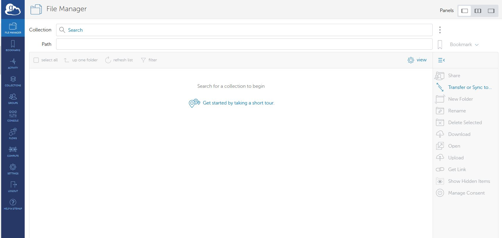
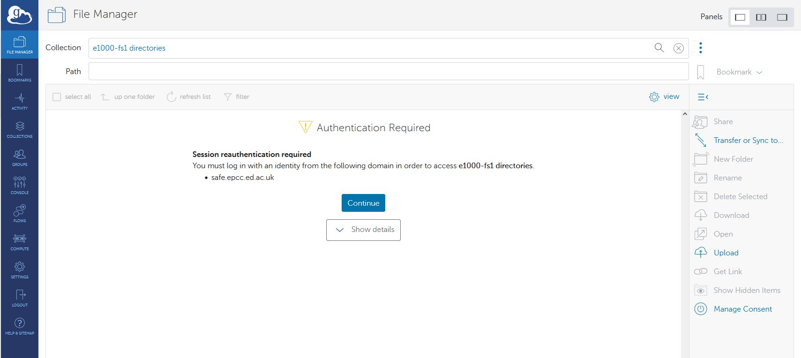
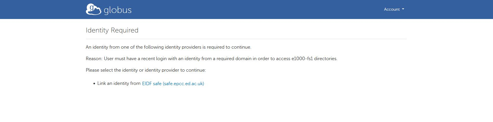
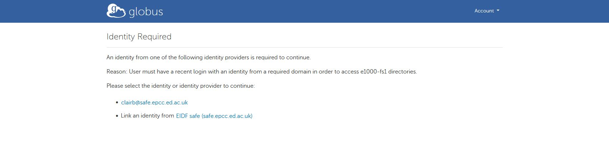
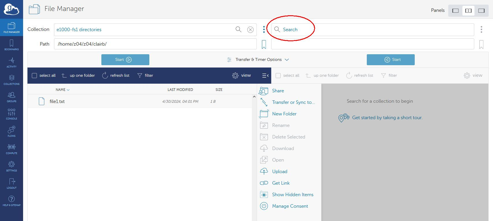

# Using Globus to transfer data to/from Cirrus /work filesystem

## Setting up Cirrus /work

Navigate to [https://app.globus.org](https://app.globus.org)

Log in with your Globus identity (this could be a globusid.org or other identity)

In File Manager, use the search tool to search for “e1000-fs1 directories”. Select it.

In the transfer pane, you are told that Authentication/Consent is required. Click Continue.

Click on the EIDF safe (safe.epcc.ed.ac.uk) link

Select the correct User account (if you have more than one)

Click Accept

Now confirm your Globus credentials – click Continue

Click on the SAFE id you selected previously

Make sure the correct User account is selected and Accept again

Your Cirrus /work directory will be shown 

!!! Warning 
    Your Cirrus `/work` directory will be listed as `/home/projectID/projectID/username`   
    The file system which is used for `/work` on Cirrus is mounted as `/home` on the e1000

## Setting up the other end of the transfer

### Laptop

If you wish to transfer data to/from your personal laptop or other device, click on the Collection Search

Use the link to “Get Globus Connect Personal” to create a Collection for your local drive.

### Other server e.g. JASMIN 

If you wish to connect to another server, you will need to search for the Collection e.g. JASMIN Default Collection and authenticate

Please see the [JASMIN Globus page for more information](https://help.jasmin.ac.uk/docs/data-transfer/globus-transfers-with-jasmin/)

Once you are connected to both the Source and Destination Collections, you can use the File Manager to select the files to be transferred, and the click the Start button to initiate the transfer

A pop-up will appear once the Transfer request has been submitted successfully

Clicking on the “View Details” will show the progress and final status of the transfer

## Using a different Cirrus account

If you want to use Globus with a different account on Cirrus, you will have to go to Settings

Manage Identities

And Unlink the current EIDF safe identity, then repeat the link process with the other Cirrus account