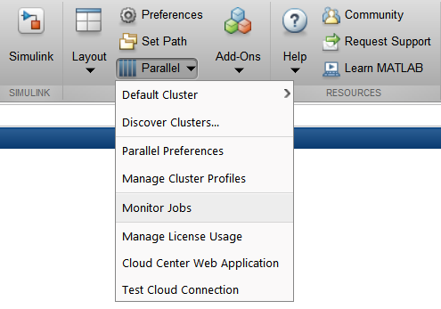

MATLAB
======

`MATLAB <https://uk.mathworks.com>`__ combines a desktop environment
tuned for iterative analysis and design processes with a programming
language that expresses matrix and array mathematics directly.

Useful Links
------------

* `MATLAB Documentation <https://uk.mathworks.com/help/index.html>`__

Using MATLAB on Cirrus
----------------------------

MATLAB R2018b is available on Cirrus.

This installation of MATLAB on Cirrus is covered by an Academic
License - for use in teaching, academic research, and meeting course
requirements at degree granting institutions only.  Not for
government, commercial, or other organizational use.

**If your use of MATLAB is not covered by this license then please do
not use this installation.**  Please contact the `Cirrus Helpdesk
<http://www.cirrus.ac.uk/support/>`_ to arrange use of your own
MATLAB license on Cirrus.

.. highlight:: none

This is MATLAB Version 9.5.0.1033004 (R2018b) Update 2 and provides the
following toolboxes ::

 MATLAB                                  Version 9.5
 Simulink                                Version 9.2
 5G Toolbox                              Version 1.0
 Aerospace Blockset                      Version 4.0
 Aerospace Toolbox                       Version 3.0
 Antenna Toolbox                         Version 3.2
 Audio System Toolbox                    Version 1.5
 Automated Driving System Toolbox        Version 1.3
 Bioinformatics Toolbox                  Version 4.11
 Communications Toolbox                  Version 7.0
 Computer Vision System Toolbox          Version 8.2
 Control System Toolbox                  Version 10.5
 Curve Fitting Toolbox                   Version 3.5.8
 DO Qualification Kit                    Version 3.6
 DSP System Toolbox                      Version 9.7
 Database Toolbox                        Version 9.0
 Datafeed Toolbox                        Version 5.8
 Deep Learning Toolbox                   Version 12.0
 Econometrics Toolbox                    Version 5.1
 Embedded Coder                          Version 7.1
 Filter Design HDL Coder                 Version 3.1.4
 Financial Instruments Toolbox           Version 2.8
 Financial Toolbox                       Version 5.12
 Fixed-Point Designer                    Version 6.2
 Fuzzy Logic Toolbox                     Version 2.4
 GPU Coder                               Version 1.2
 Global Optimization Toolbox             Version 4.0
 HDL Coder                               Version 3.13
 HDL Verifier                            Version 5.5
 IEC Certification Kit                   Version 3.12
 Image Acquisition Toolbox               Version 5.5
 Image Processing Toolbox                Version 10.3
 Instrument Control Toolbox              Version 3.14
 LTE HDL Toolbox                         Version 1.2
 LTE Toolbox                             Version 3.0
 MATLAB Coder                            Version 4.1
 MATLAB Distributed Computing Server     Version 6.13
 MATLAB Report Generator                 Version 5.5
 Mapping Toolbox                         Version 4.7
 Model Predictive Control Toolbox        Version 6.2
 Optimization Toolbox                    Version 8.2
 Parallel Computing Toolbox              Version 6.13
 Partial Differential Equation Toolbox   Version 3.1
 Phased Array System Toolbox             Version 4.0
 Polyspace Bug Finder                    Version 2.6
 Polyspace Code Prover                   Version 9.10
 Powertrain Blockset                     Version 1.4
 Predictive Maintenance Toolbox          Version 1.1
 RF Blockset                             Version 7.1
 RF Toolbox                              Version 3.5
 Risk Management Toolbox                 Version 1.4
 Robotics System Toolbox                 Version 2.1
 Robust Control Toolbox                  Version 6.5
 Sensor Fusion and Tracking Toolbox      Version 1.0
 Signal Processing Toolbox               Version 8.1
 SimBiology                              Version 5.8.1
 SimEvents                               Version 5.5
 Simscape                                Version 4.5
 Simscape Driveline                      Version 2.15
 Simscape Electrical                     Version 7.0
 Simscape Fluids                         Version 2.5
 Simscape Multibody                      Version 6.0
 Simulink 3D Animation                   Version 8.1
 Simulink Check                          Version 4.2
 Simulink Code Inspector                 Version 3.3
 Simulink Coder                          Version 9.0
 Simulink Control Design                 Version 5.2
 Simulink Coverage                       Version 4.2
 Simulink Design Optimization            Version 3.5
 Simulink Report Generator               Version 5.5
 Simulink Requirements                   Version 1.2
 Simulink Test                           Version 2.5
 Stateflow                               Version 9.2
 Statistics and Machine Learning Toolbox Version 11.4
 Symbolic Math Toolbox                   Version 8.2
 System Identification Toolbox           Version 9.9
 Text Analytics Toolbox                  Version 1.2
 Trading Toolbox                         Version 3.5
 Vehicle Dynamics Blockset               Version 1.1
 Vehicle Network Toolbox                 Version 4.1
 Vision HDL Toolbox                      Version 1.7
 WLAN Toolbox                            Version 2.0
 Wavelet Toolbox                         Version 5.1

Running MATLAB jobs
-------------------

On Cirrus, MATLAB is intended to be used on the compute nodes within
Slurm job scripts.  Use on the login nodes should be restricted to
setting preferences, accessing help, and launching MDCS jobs.  It is
recommended that MATLAB is used without a GUI on the compute nodes, as
the interactive response is slow.

.. _local:

Running parallel MATLAB jobs using the *local* cluster
------------------------------------------------------

The license for this installation of MATLAB provides only 32 workers
via MDCS but provides 36 workers via the local cluster profile (there
are 36 cores on a Cirrus compute node), so we only recommend the use
of MDCS to test the configuration of distributed memory parallel
computations for eventual use of your own MDCS license.

The *local* cluster should be used within a Slurm job script - you
submit a job that runs MATLAB and uses the *local* cluster, which is
the compute node that the job is running on.

MATLAB will normally use up to the total number of cores on a node for
multi-threaded operations (e.g. matrix inversions) and for parallel
computations.  It also make no restriction on its memory use.  These
features are incompatible with the shared use of nodes on Cirrus.  For
the *local* cluster, a wrapper script is provided to limit the number
of cores and amount of memory used, in proportion to the number of
CPUs selected in the Slurm job script.  Please use this wrapper instead
of using MATLAB directly.

.. highlight:: bash

Say you have a job that requires 3 workers, each running 2 threads.
As such, you should employ 3x2=6 cores.  An example job script for
this particular case would be ::

  #SBATCH --job-name=Example_MATLAB_Job
  #SBATCH --time=0:20:0
  #SBATCH --nodes=1
  #SBATCH --tasks-per-node=6
  #SBATCH --cpus-per-task=1

 
  # Replace [budget code] below with your project code (e.g. t01)
  #SBATCH --account=[budget code]
  # Replace [partition name] below with your partition name (e.g. standard,gpu)
  #SBATCH --partition=[partition name]
  # Replace [qos name] below with your qos name (e.g. standard,long,gpu)
  #SBATCH --qos=[qos name]

  module load matlab
 
  matlab_wrapper -nodisplay < /lustre/sw/cse-matlab/examples/testp.m > testp.log

.. highlight:: none

Note, for MATLAB versions R2019 and later, the `matlab_wrapper_2019` script may be required
(see 2019 section below).
	       
This would run the *testp.m* script, without a display, and exit when
*testp.m* has finished.  6 CPUs are selected, which correspond to 6
cores, and the following limits would be set initially ::

 ncores = 6
 memory = 42GB

 Maximum number of computational threads (maxNumCompThreads)          = 6
 Preferred number of workers in a parallel pool (PreferredNumWorkers) = 6
 Number of workers to start on your local machine (NumWorkers)        = 6
 Number of computational threads to use on each worker (NumThreads)   = 1

.. highlight:: matlab

The *testp.m* program sets *NumWorkers* to 3 and *NumThreads* to 2 ::
 
 cirrus_cluster = parcluster('local');
 ncores = cirrus_cluster.NumWorkers * cirrus_cluster.NumThreads;
 cirrus_cluster.NumWorkers = 3;
 cirrus_cluster.NumThreads = 2;
 fprintf("NumWorkers = %d NumThreads = %d ncores = %d\n",cirrus_cluster.NumWorkers,cirrus_cluster.NumThreads,ncores);
 if cirrus_cluster.NumWorkers * cirrus_cluster.NumThreads > ncores
     disp("NumWorkers * NumThreads > ncores");
     disp("Exiting");
     exit(1);
 end
 saveProfile(cirrus_cluster);
 clear cirrus_cluster;
 
 
 n = 3;
 A = 3000;
 
 a=zeros(A,A,n);
 b=1:n;
 
 parpool;
 
 tic
 parfor i = 1:n
     a(:,:,i) = rand(A);
 end
 toc
 tic
 parfor i = 1:n
     b(i) = max(abs(eig(a(:,:,i))));
 end
 toc

Note that *PreferredNumWorkers*, *NumWorkers* and *NumThreads* persist
between MATLAB sessions but will be updated correctly if you use the
wrapper each time.

*NumWorkers* and *NumThreads* can be changed (using *parcluster*
and *saveProfile*) but *NumWorkers* * *NumThreads* should be less than
or equal to the number of cores (*ncores* above).  If you wish a
worker to run a threaded routine in serial, you must set *NumThreads*
to 1 (the default).

If you specify exclusive node access, then all the cores and memory
will be available.  On the login nodes, a single core is used and
memory is not limited.

.. _2019:

MATLAB 2019 versions
--------------------

There has been a change of configuration options for MATLAB from version R2019 and onwards
that means the `-r` flag has been replaced with the `-batch` flag. To accommodate that a new
job wrapper script is required to run applications. For these versions of
MATLAB, if you need to use the `-r` or `-batch` flag replace this line in your Slurm script, i.e.::

  matlab_wrapper -nodisplay -nodesktop -batch "main_simulated_data_FINAL_clean("$ind","$gamma","$rw",'"$SLURM_JOB_ID"')

with::

  matlab_wrapper_2019 -nodisplay -nodesktop -batch "main_simulated_data_FINAL_clean("$ind","$gamma","$rw",'"$SLURM_JOB_ID"')

and this should allow scripts to run normally.
 
.. _MDCS:

Running parallel MATLAB jobs using MDCS
---------------------------------------

It is possible to use MATLAB on the login node to set up an MDCS
Slurm cluster profile and then launch jobs using that profile.
However, this does not give per-job control of the number of cores and
walltime; these are set once in the profile.

This MDCS profile can be used in MATLAB on the login node - the MDCS
computations are done in Slurm jobs launched using the profile.

.. highlight:: matlab

Configuration
^^^^^^^^^^^^^

Start MATLAB on the login node.  Configure MATLAB to run parallel jobs
on your cluster by calling *configCluster*.  For each cluster,
*configCluster* only needs to be called once per version of MATLAB ::

 configCluster

Jobs will now default to the cluster rather than submit to the local
machine (the login node in this case).

Configuring jobs
^^^^^^^^^^^^^^^^

Prior to submitting the job, you can specify various parameters to
pass to our jobs, such as walltime, e-mail, etc.  Other than
*ProjectCode* and *WallTime*, none of these are required to be set.

NOTE: Any parameters specified using this workflow will be persistent
between MATLAB sessions ::

 % Get a handle to the cluster.
 c = parcluster('cirrus');

 % Assign the project code for the job.  **[REQUIRED]**
 c.AdditionalProperties.ProjectCode = 'project-code';

 % Specify the walltime (e.g. 5 hours).  **[REQUIRED]**
 c.AdditionalProperties.WallTime = '05:00:00';

 % Specify e-mail address to receive notifications about your job.
 c.AdditionalProperties.EmailAddress = 'your_name@your_address';

 % Request a specific reservation to run your job.  It is better to
 % use the queues rather than a reservation.
 c.AdditionalProperties.Reservation = 'your-reservation';

 % Set the job placement (e.g., pack, excl, scatter:excl).
 % Usually the default of free is what you want.
 c.AdditionalProperties.JobPlacement = 'pack';

 % Request to run in a particular queue.  Usually the default (no
 % specific queue requested) will route the job to the correct queue.
 c.AdditionalProperties.QueueName = 'queue-name';

 % If you are using GPUs, request up to 4 GPUs per node (this will
 % override a requested queue name and will use the 'gpu' queue).
 c.AdditionalProperties.GpusPerNode = 4;

Save changes after modifying *AdditionalProperties* fields ::

 c.saveProfile

To see the values of the current configuration options, call the
specific *AdditionalProperties* name ::

 c.AdditionalProperties

To clear a value, assign the property an empty value (*''*, *[]*, or *false*) ::

 % Turn off email notifications.
 c.AdditionalProperties.EmailAddress = '';

Interactive jobs
^^^^^^^^^^^^^^^^

To run an interactive pool job on the cluster, use *parpool* as
before.  *configCluster* sets *NumWorkers* to 32 in the cluster to
match the number of MDCS workers available in our TAH licence.  If you
have your own MDCS licence, you can change this by setting
*c.NumWorkers* and saving the profile. ::

 % Open a pool of 32 workers on the cluster.
 p = parpool('cirrus',32);

Rather than running locally on one compute node machine, this pool
can run across multiple nodes on the cluster ::

 % Run a parfor over 1000 iterations.
 parfor idx = 1:1000
   a(idx) = ...
 end

Once you have finished using the pool, delete it ::

 % Delete the pool
 p.delete

Serial jobs
^^^^^^^^^^^

Rather than running interactively, use the *batch* command to submit
asynchronous jobs to the cluster.  This is generally more useful on
Cirrus, which usually has long queues.  The *batch* command will
return a job object which is used to access the output of the
submitted job.  See the MATLAB documentation for more help on
*batch* ::

 % Get a handle to the cluster.
 c = parcluster('cirrus');

 % Submit job to query where MATLAB is running on the cluster.
 j = c.batch(@pwd, 1, {});

 % Query job for state.
 j.State

 % If state is finished, fetch results.
 j.fetchOutputs{:}

 % Delete the job after results are no longer needed.
 j.delete

To retrieve a list of currently running or completed jobs, call
*parcluster* to retrieve the cluster object.  The cluster object
stores an array of jobs that were run, are running, or are queued to
run.  This allows you to fetch the results of completed jobs.  Retrieve
and view the list of jobs as shown below ::

 c = parcluster('cirrus');
 jobs = c.Jobs

Once you have identified the job you want, you can retrieve the
results as you have done previously.

*fetchOutputs* is used to retrieve function output arguments; if using
batch with a script, use *load* instead.  Data that has been written to
files on the cluster needs be retrieved directly from the file system.

To view results of a previously completed job ::

 % Get a handle on job with ID 2.
 j2 = c.Jobs(2);

NOTE:  You can view a list of your jobs, as well as their IDs, using
the above *c.Jobs* command ::

 % Fetch results for job with ID 2.
 j2.fetchOutputs{:}

 % If the job produces an error, view the error log file.
 c.getDebugLog(j.Tasks(1))

NOTE:  When submitting independent jobs, with multiple tasks, you will
have to specify the task number.

Parallel jobs
^^^^^^^^^^^^^

Users can also submit parallel workflows with batch.  You can use the
following example (*parallel_example.m*) for a parallel job ::

 function t = parallel_example(iter)

   if nargin==0, iter = 16; end

   disp('Start sim')

   t0 = tic;
   parfor idx = 1:iter
     A(idx) = idx;
     pause(2);
   end
   t =toc(t0);

   disp('Sim completed.')

Use the *batch* command again, but since you are running a parallel
job, you also specify a MATLAB Pool ::

 % Get a handle to the cluster.
 c = parcluster('cirrus');

 % Submit a batch pool job using 4 workers for 16 simulations.
 j = c.batch(@parallel_example, 1, {}, 'Pool', 4);

 % View current job status.
 j.State

 % Fetch the results after a finished state is retrieved.
 j.fetchOutputs{:}

 ans =

 8.8872

The job ran in 8.89 seconds using 4 workers.  Note that these jobs will
always request N+1 CPU cores, since one worker is required to manage the
batch job and pool of workers.  For example, a job that needs eight
workers will consume nine CPU cores.  With a MDCS licence for 32 workers,
you will be able to have a pool of 31 workers.

Run the same simulation but increase the Pool size.  This time, to
retrieve the results later, keep track of the job ID.

NOTE:  For some applications, there will be a diminishing return when
allocating too many workers, as the overhead may exceed computation
time. ::
  

 % Get a handle to the cluster.
 c = parcluster('cirrus');

 % Submit a batch pool job using 8 workers for 16 simulations.
 j = c.batch(@parallel_example, 1, {}, 'Pool', 8);

 % Get the job ID
 id = j.ID

 Id =

 4

::
   
 % Clear workspace, as though you have quit MATLAB.
 clear j

Once you have a handle to the cluster, call the *findJob* method to
search for the job with the specified job ID ::

 % Get a handle to the cluster.
 c = parcluster('cirrus');

 % Find the old job
 j = c.findJob('ID', 4);

 % Retrieve the state of the job.
 j.State

 ans

 finished

 % Fetch the results.
 j.fetchOutputs{:};

 ans =

 4.7270

 % If necessary, retrieve an output/error log file.
 c.getDebugLog(j)

The job now runs 4.73 seconds using 8 workers.  Run code with different
number of workers to determine the ideal number to use.

Alternatively, to retrieve job results via a graphical user interface,
use the Job Monitor (Parallel > Monitor Jobs).

|image1|

Debugging
^^^^^^^^^

If a serial job produces an error, you can call the *getDebugLog* method to
view the error log file ::

 j.Parent.getDebugLog(j.Tasks(1))

When submitting independent jobs, with multiple tasks, you will have to
specify the task number.  For Pool jobs, do not dereference into the job
object ::

 j.Parent.getDebugLog(j)

The scheduler ID can be derived by calling *schedID* ::

 schedID(j)

 ans

 25539

To learn more
^^^^^^^^^^^^^

To learn more about the MATLAB Parallel Computing Toolbox, check out
these resources:

* `Parallel Computing Coding Examples <http://www.mathworks.com/products/parallel-computing/code-examples.html>`__

* `Parallel Computing Documentation <http://www.mathworks.com/help/distcomp/index.html>`__

* `Parallel Computing Overview <http://www.mathworks.com/products/parallel-computing/index.html>`__

* `Parallel Computing Tutorials <http://www.mathworks.com/products/parallel-computing/tutorials.html>`__

* `Parallel Computing Videos <http://www.mathworks.com/products/parallel-computing/videos.html>`__

* `Parallel Computing Webinars <http://www.mathworks.com/products/parallel-computing/webinars.html>`__

.. _GPU:

GPUs
----

Calculations using GPUs can be done using the :doc:`GPU nodes
<../user-guide/gpu>`.  This can be done using MATLAB within a Slurm job
script, similar to :ref:`using the local cluster <local>`, or can be
done using the :ref:`MDCS profile <MDCS>`.  The GPUs are shared unless
you request exclusive access to the node (4 GPUs), so you may find
that you share a GPU with another user.

